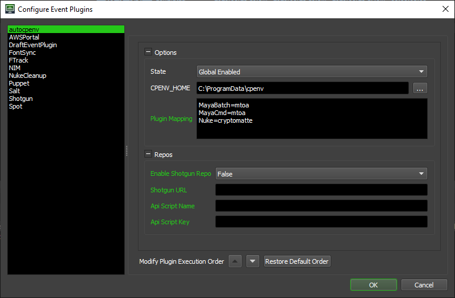

=========
autocpenv
=========

Deadline Event Plugin that automatically activates a cpenv environment when a worker starts rendering a task.

Installation
============
1. Clone this git repository into your Deadline repository's custom events location::

    cd DEADLINE_REPOSITORY_PATH/custom/events
    git clone https://github.com/cpenv/autocpenv.git

2. Copy GlobalJobPreLoad.py to DEADLINE_REPOSITORY_PATH/custom/plugins or add the contents of GlobalJobPreLoad.py to your own if you're already using one.

3. Use git pull to upgrade autocpenv::

    cd DEADLINE_REPOSITORY_PATH/custom/events/autocpenv
    git pull origin master

Configuration
=============
Open Deadline Monitor and enable *super user* mode in the tools menu. Then open the *Configure Event Plugins* dialog also in tools menu.

Options
-------
- State: How this event plug-in should respond to events. If Global, all jobs and workers will trigger the events for this plugin. If Opt-In, jobs and workers can choose to trigger the events for this plugin. If Disabled, no events are triggered for this plugin.
- CPENV_HOME: Path to cpenv home. Defaults to a local directory. Can be set to a shared network location. Place a config.yml file within the home directory to configure repositories. See the cpenv documentation for more info.
- Plugin Mapping: Mapping of deadline plugins to cpenv environments. Each line should start with a deadline plugin and end with a space separate list of cpenv environment paths.
 + Each line configures a Deadline Plugin
 + **{Deadline_Plugin}={cpenv_module}**
- Enable Shotgun Repo: `Setup a Shotgun api script <https://support.shotgunsoftware.com/hc/en-us/articles/219031368-Create-and-manage-API-scripts>`_
 + Shotgun URL: Path to Shotgun site (https://my.shotgunstudio.com)
 + Api Script Name
 + Api Script Key

Documentation
=============
Visit the `cpenv repo <https://github.com/cpenv/cpenv>`_ for additional help.
